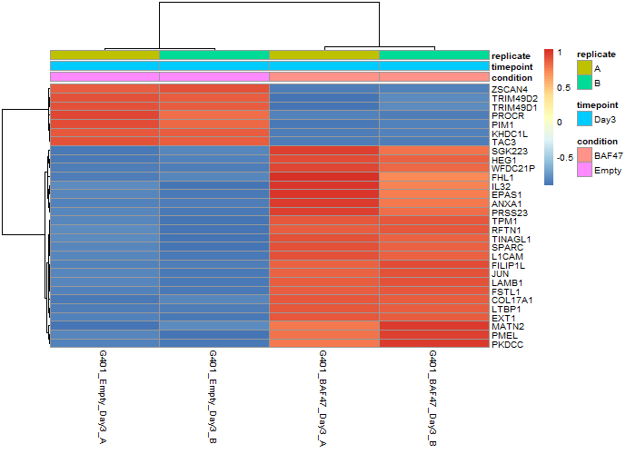

# SMARCB1/BAF47 Restoration in G401 Cells

> An end-to-end bulk RNA-seq portfolio project combining reproducible data processing, differential expression, pathway enrichment, and biologically cautious interpretation.

[](https://www.r-project.org/)
[](https://bioconductor.org/packages/DESeq2/)
[](https://www.ncbi.nlm.nih.gov/geo/query/acc.cgi?acc=GSE90633)
[](#reproduce-the-analysis)

## Project at a Glance

This project reanalyzes public bulk RNA-seq data to investigate transcriptional changes associated with restoring **SMARCB1/BAF47** in G401 malignant rhabdoid tumor cells. It follows the analysis from sample-level processed counts through quality control, differential expression, Hallmark gene-set enrichment, visualization, and interpretation.

The repository is designed as a computational biology portfolio project: the emphasis is not only on obtaining significant genes, but on constructing a traceable workflow and communicating what a small public dataset can—and cannot—support.

### What this project demonstrates

- **Bulk RNA-seq analysis:** count-matrix construction, sample metadata design, filtering, normalization, and exploratory quality control.
- **Statistical modeling:** DESeq2-based estimation of the BAF47-versus-empty-vector contrast with multiple-testing correction.
- **Pathway interpretation:** preranked Hallmark GSEA with normalized enrichment scores and adjusted p-values.
- **Scientific visualization:** PCA, sample correlation, MA and volcano plots, and a top-gene heatmap.
- **Reproducible engineering:** ordered R scripts, machine-readable outputs, clear data provenance, and a detailed technical report.
- **Scientific judgment:** explicit treatment of low replication, model scope, association versus causation, and lack of external validation.

## Key Results

| Area | Result |
|---|---|
| Dataset | Four G401 Day 3 samples: two BAF47-restored and two empty-vector controls |
| Differential expression | 17,220 genes tested; 2,314 met `padj < 0.05` and `|log2FC| > 1` |
| Direction of change | 1,654 genes had positive and 660 had negative log2 fold change |
| Positive enrichment | EMT was strongly enriched (`NES = 2.52`, adjusted `p = 5.61 × 10⁻¹⁹`) |
| Negative enrichment | MYC Targets V1 was strongly depleted (`NES = -2.98`, adjusted `p = 1.97 × 10⁻²⁹`) |
| Main constraint | Exploratory design with `n = 2` biological replicates per condition |

These findings describe associations in one cell line at one time point. They are not independent functional validation of SMARCB1/BAF47 activity.

## Selected Visuals

| Sample structure | Differential expression | Top regulated genes |
|---|---|---|
|  |  |  |

## Analytical Workflow

```text
GEO sample-level processed counts
                |
                v
       Merge count matrix + metadata
                |
                v
     Library-size QC + VST + PCA
                |
                v
       DESeq2: BAF47 vs Empty
          /                 \
         v                   v
MA / volcano / heatmap   Hallmark preranked GSEA
         \                   /
          +--------+---------+
                   v
          biological interpretation
```

| Stage | Main question | Methods | Primary artifact |
|---|---|---|---|
| 01. Matrix construction | Are sample-level files aligned into an analysis-ready matrix? | count-file parsing, gene intersection, metadata validation | `scripts/01_build_count_matrix.R` |
| 02. QC and exploration | Do samples have comparable depth and condition-level structure? | library sizes, VST, PCA, sample correlation | `scripts/02_qc_pca.R` |
| 03. Differential expression | Which genes differ between restored and control cells? | DESeq2 condition model, Wald test, FDR correction | `scripts/03_deseq2.R` |
| 04. Visualization | Are effect size, significance, and sample patterns coherent? | MA plot, volcano plot, top-30 heatmap | `scripts/04_visualization.R` |
| 05. Pathway enrichment | Which coordinated biological programs shift with BAF47? | Hallmark preranked GSEA with `fgsea` | `scripts/05_gsea.R` |

## Technical Highlights

### Differential-expression analysis

The DESeq2 model estimates the Day 3 G401 condition contrast, **BAF47 restored versus empty vector**. Significance is defined using both statistical confidence and effect size:

```text
adjusted p-value < 0.05 and |log2 fold change| > 1
```

Representative positively associated genes include `LAMB1`, `LTBP1`, `FSTL1`, `COL17A1`, and `SPARC`. The largest signals should be interpreted in the context of the complete ranked gene list rather than as isolated candidate claims.

### Pathway-level interpretation

Preranked GSEA tests whether coordinated gene programs shift across the full differential-expression ranking.

| Hallmark pathway | NES | Adjusted p-value | Direction in BAF47 condition |
|---|---:|---:|---|
| MYC Targets V1 | -2.98 | 1.97 × 10⁻²⁹ | Negative |
| MYC Targets V2 | -3.06 | 1.27 × 10⁻²⁰ | Negative |
| Epithelial–Mesenchymal Transition | 2.52 | 5.61 × 10⁻¹⁹ | Positive |
| E2F Targets | -2.57 | 3.51 × 10⁻¹⁸ | Negative |
| Myogenesis | 2.36 | 8.32 × 10⁻¹⁵ | Positive |
| G2M Checkpoint | -2.18 | 3.58 × 10⁻¹⁰ | Negative |

The pattern is consistent with reduced proliferative programs and increased differentiation/adhesion-associated programs after BAF47 restoration. Because this is an observational reanalysis of a small experiment, pathway activity is presented as a hypothesis rather than a mechanistic conclusion.

## Repository Structure

```text
kadoch-rnaseq-g401/
├── data/
│   ├── metadata/       # Sample design and GEO series metadata
│   ├── processed/      # Merged gene-by-sample count matrix
│   └── raw/            # GEO sample-level processed count files
├── scripts/            # Ordered R analysis scripts (01–05)
├── results/
│   ├── figures/        # QC, DE, and expression visualizations
│   └── tables/         # DESeq2, GSEA, PCA, and QC outputs
├── report/             # Detailed technical report
└── README.md
```

## Reproduce the Analysis

### 1. Clone the repository

```bash
git clone https://github.com/XiangyangHu2003/kadoch-rnaseq-g401.git
cd kadoch-rnaseq-g401
```

### 2. Install the R dependencies

The workflow uses:

- `tidyverse`
- `DESeq2`
- `pheatmap`
- `ggrepel`
- `msigdbr`
- `fgsea`

Bioconductor packages can be installed with `BiocManager`; CRAN packages can be installed with `install.packages()`.

### 3. Run the ordered scripts

From the repository root:

```bash
Rscript scripts/01_build_count_matrix.R
Rscript scripts/02_qc_pca.R
Rscript scripts/03_deseq2.R
Rscript scripts/04_visualization.R
Rscript scripts/05_gsea.R
```

Inputs are the four committed count files under `data/raw/` and the design table at `data/metadata/metadata.csv`. Generated figures and tables are written to `results/`.

> **Reproducibility note:** package versions are not currently locked. The committed outputs document the analysis state, but exact cross-version reproduction will require an environment lockfile and saved session information.

## Tools and Methods

- **Language:** R
- **Data wrangling:** tidyverse
- **Differential expression:** DESeq2
- **Pathway analysis:** `fgsea` with MSigDB Hallmark gene sets from `msigdbr`
- **Visualization:** ggplot2, ggrepel, pheatmap
- **Quality control:** library-size comparison, variance-stabilizing transformation, PCA, and sample correlation
- **Reproducibility:** ordered scripts, explicit metadata, committed source counts, and machine-readable result tables

## Main Conclusions

1. The four samples separate by condition in the current PCA, indicating a strong BAF47-associated transcriptional signal.
2. BAF47 restoration is associated with broad gene-expression changes, including extracellular-matrix and differentiation-related genes.
3. Hallmark GSEA identifies positive EMT/differentiation-associated enrichment and negative MYC, E2F, and G2M enrichment.
4. The pathway pattern is compatible with reduced proliferative programs after BAF47 restoration, but does not establish mechanism.
5. All conclusions remain exploratory because the design contains only two replicates per condition and no independent validation cohort.

## Limitations

- The analysis contains one cell line, one time point, and two biological replicates per condition.
- The condition-only model cannot estimate additional biological or technical covariates.
- GSEA is hypothesis-generating and does not experimentally establish pathway activity.
- No independent dataset or orthogonal assay is used for validation.
- The repository begins with GEO processed counts; alignment and transcript quantification are outside its scope.
- Package versions are not yet locked for exact environment reproduction.

## Technical Report

For detailed data provenance, methods, interpretation, output descriptions, and recommended next steps, see [`report/g401_smarcb1_rnaseq_technical_report.md`](report/g401_smarcb1_rnaseq_technical_report.md).

## Data and Reference

- Dataset: [GEO GSE90633](https://www.ncbi.nlm.nih.gov/geo/query/acc.cgi?acc=GSE90633), part of [SuperSeries GSE90634](https://www.ncbi.nlm.nih.gov/geo/query/acc.cgi?acc=GSE90634)
- Study: Nakayama RT, Pulice JL, Valencia AM, et al. *SMARCB1 is required for widespread BAF complex-mediated activation of enhancers and bivalent promoters.* Nature Genetics. 2017;49(11):1613–1623. [doi:10.1038/ng.3958](https://doi.org/10.1038/ng.3958) · [PMID: 28945250](https://pubmed.ncbi.nlm.nih.gov/28945250/)

## Author

**Xiangyang Hu**

This is an independent computational biology portfolio reanalysis of public data, not the original study's analysis repository.
