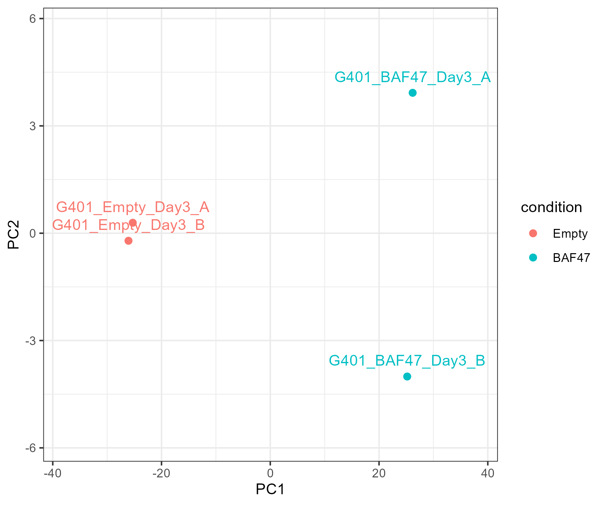
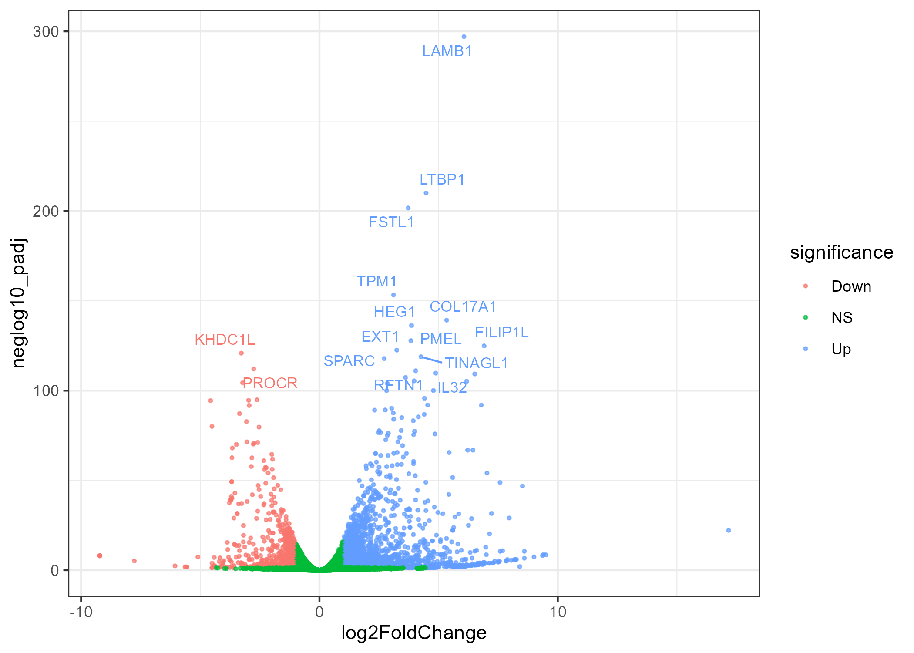

# Reproducible bulk RNA-seq analysis of SMARCB1/BAF47 re-expression in G401 cells

## Project summary

This project presents a reproducible bulk RNA-seq workflow for analyzing transcriptional changes associated with **SMARCB1/BAF47 re-expression** in **G401 malignant rhabdoid tumor cells**.

Using public RNA-seq data, I built an end-to-end analysis workflow in **R** that includes:

-   count matrix construction from sample-level read count files
-   sample QC and PCA
-   differential expression analysis with **DESeq2**
-   publication-style visualization
-   Hallmark pathway enrichment analysis with **fgsea**

This repository is intended as a compact portfolio project for computational biology and bioinformatics applications.

------------------------------------------------------------------------

## Biological question

**What transcriptional programs change after SMARCB1/BAF47 re-expression in G401 malignant rhabdoid tumor cells?**

This project compares **BAF47 re-expression** versus **Empty control** in G401 cells and identifies differentially expressed genes and enriched pathways associated with this perturbation.

------------------------------------------------------------------------

## Dataset

Samples used in this first version:

-   G401_Empty_Day3_A
-   G401_Empty_Day3_B
-   G401_BAF47_Day3_A
-   G401_BAF47_Day3_B

Input files are sample-level `read_cnt.txt` files and a manually curated metadata table.

------------------------------------------------------------------------

## Methods

Main tools used in this project:

-   **R**
-   **tidyverse**
-   **DESeq2**
-   **ggplot2**
-   **pheatmap**
-   **msigdbr**
-   **fgsea**

Analysis steps:

1.  Build a merged count matrix from raw per-sample count files\
2.  Perform sample-level QC and PCA\
3.  Run differential expression analysis with DESeq2\
4.  Generate a volcano plot and top-gene heatmap\
5.  Run Hallmark gene set enrichment analysis

------------------------------------------------------------------------

## Key outputs

Main outputs generated by this workflow include:

-   merged count matrix
-   library size summary
-   PCA plot
-   sample correlation heatmap
-   MA plot
-   volcano plot
-   top 30 DE gene heatmap
-   DESeq2 result tables
-   Hallmark GSEA results

------------------------------------------------------------------------

## Figures

### PCA plot



------------------------------------------------------------------------

### Volcano plot



------------------------------------------------------------------------

## Repository structure

``` text
kadoch-rnaseq-g401/
├── data/
│   ├── metadata/
│   └── processed/
├── scripts/
├── results/
│   ├── figures/
│   └── tables/
├── report/
└── README.md
```

------------------------------------------------------------------------

## How to run

Run the scripts in the following order:

``` text
01_build_count_matrix.R
02_qc_pca.R
03_deseq2.R
04_visualization.R
05_gsea.R
```

Expected inputs:

-   sample count files in `data/raw/`
-   metadata file in `data/metadata/metadata.csv`

Main results will be written to:

-   `results/figures/`
-   `results/tables/`

------------------------------------------------------------------------

## Notes

This first version focuses only on:

-   one cell line: **G401**
-   one time point: **Day 3**
-   one comparison: **BAF47 vs Empty**

This reduced design keeps the project compact, interpretable, and easy to reproduce.

------------------------------------------------------------------------

## Future extensions

Possible next steps include:

-   adding G401 Day 7 samples
-   adding TTC1240 samples
-   comparing Day 3 and Day 7 responses
-   improving reproducibility with a locked environment
-   expanding the project into a full technical report

------------------------------------------------------------------------

## Contact / usage note

This repository is intended as a transcriptomics portfolio project demonstrating practical skills in RNA-seq analysis, visualization, and reproducible research workflows.
