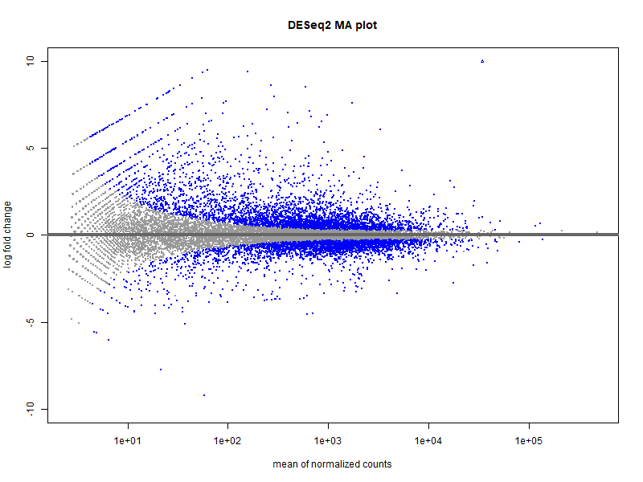

# Technical Report

## Reproducible bulk RNA-seq analysis of SMARCB1/BAF47 re-expression in G401 malignant rhabdoid tumor cells

**Author:** Xiangyang Hu\
**Project type:** Bulk RNA-seq reanalysis\
**Date:** 2026-04-02

------------------------------------------------------------------------

## 1. Executive summary

This report summarizes a reproducible bulk RNA-seq analysis evaluating
transcriptional changes after **SMARCB1/BAF47 re-expression** in **G401
malignant rhabdoid tumor cells**.

The first version of the project focused on four **Day 3** samples:

-   G401_Empty_Day3_A\
-   G401_Empty_Day3_B\
-   G401_BAF47_Day3_A\
-   G401_BAF47_Day3_B

The workflow included:

-   construction of a merged count matrix from sample-level read count
    files
-   sample-level quality control
-   PCA-based sample structure assessment
-   differential expression analysis using **DESeq2**
-   visualization of differential expression patterns
-   Hallmark pathway enrichment analysis using **fgsea**

Overall, the analysis showed that **BAF47 re-expression was associated
with broad transcriptional remodeling** in G401 cells. In this
first-pass analysis, **17,220 genes** were tested and **2,314 genes**
met the significance threshold of **adjusted p-value \< 0.05** and
**\|log2 fold change\| \> 1**. At the pathway level, genes upregulated
with BAF47 re-expression were enriched for programs including
**epithelial-mesenchymal transition**, **myogenesis**, **estrogen
response**, and **apical junction**, whereas negatively enriched
programs included **MYC targets**, **E2F targets**, **G2M checkpoint**,
and **DNA repair**.

These results are consistent with a substantial shift in transcriptional
state following SMARCB1/BAF47 restoration.

------------------------------------------------------------------------

## 2. Background and objective

SMARCB1 (also known as **BAF47**) is a core component of the SWI/SNF or
BAF chromatin remodeling complex and is recurrently altered in rhabdoid
tumors. Re-expression of SMARCB1 in SMARCB1-deficient tumor cells
provides a tractable system for evaluating how chromatin regulatory
restoration reshapes transcriptional programs.

The objective of this project was to build a compact, reproducible
RNA-seq workflow that answers the following question:

**What transcriptional programs change after SMARCB1/BAF47 re-expression
in G401 malignant rhabdoid tumor cells?**

------------------------------------------------------------------------

## 3. Dataset and analysis scope

### 3.1 Samples analyzed

This version of the analysis used four sample-level read count files:

-   `G401_Empty_Day3_A.read_cnt.txt`
-   `G401_Empty_Day3_B.read_cnt.txt`
-   `G401_BAF47_Day3_A.read_cnt.txt`
-   `G401_BAF47_Day3_B.read_cnt.txt`

### 3.2 Metadata structure

Samples were annotated by:

-   condition (`Empty` vs `BAF47`)
-   timepoint (`Day3`)
-   replicate (`A` or `B`)

### 3.3 Scope of this report

This report summarizes only the **G401 Day 3** comparison:

-   one cell line
-   one time point
-   one perturbation contrast: **BAF47 vs Empty**

This intentionally reduced scope keeps the first version of the project
interpretable and reproducible.

------------------------------------------------------------------------

## 4. Methods

### 4.1 Count matrix construction

Sample-level read count files were loaded in R and merged by
`GeneSymbol` to generate a single count matrix for downstream analysis.
Only the `GeneSymbol` and `Read.Count` columns were used for the
count-based workflow.

### 4.2 Quality control and exploratory analysis

A `DESeqDataSet` was created from the merged count matrix and the sample
metadata table. Genes with very low counts were filtered before
downstream analysis. Quality assessment included:

-   library size comparison
-   variance-stabilizing transformation
-   principal component analysis (PCA)
-   sample-to-sample correlation heatmap

### 4.3 Differential expression analysis

Differential expression analysis was performed with **DESeq2** using the
design:

``` r
~ condition
```

The primary contrast was:

``` r
BAF47 vs Empty
```

Genes were defined as significant if they satisfied both:

-   adjusted p-value (`padj`) \< 0.05
-   absolute log2 fold change \> 1

### 4.4 Pathway analysis

Hallmark gene set enrichment analysis was performed using:

-   `msigdbr` for Hallmark gene set retrieval
-   `fgsea` for preranked enrichment analysis

Genes were ranked using the DESeq2 Wald statistic.

------------------------------------------------------------------------

## 5. Results

## 5.1 Quality control and sample structure

Library sizes were broadly comparable across all four samples, ranging
from approximately **20.1 million** to **24.7 million** counts. This
suggests that sequencing depth was of similar order across the analyzed
libraries.

PCA showed clear separation between the two experimental conditions
along **PC1**, with the two `Empty` replicates clustering together and
the two `BAF47` replicates clustering together. In the current output,
the `Empty` samples had negative PC1 coordinates while the `BAF47`
samples had positive PC1 coordinates, indicating that the primary source
of variation in the dataset corresponded to condition rather than
replicate identity.


------------------------------------------------------------------------

## 5.2 Differential expression analysis

A total of **17,220 genes** were tested in the DESeq2 analysis. Among
these, **2,314 genes** met the significance criteria used in this
project.

Breakdown of significant genes:

-   **1,654 genes** were upregulated in `BAF47`
-   **660 genes** were downregulated in `BAF47`

This indicates that BAF47 re-expression was associated with widespread
transcriptional changes rather than a small targeted response.

### Representative significantly changed genes

Examples of highly significant genes included:

-   `LAMB1`
-   `LTBP1`
-   `FSTL1`
-   `TPM1`
-   `COL17A1`
-   `HEG1`
-   `PMEL`
-   `FILIP1L`

Among genes with strong positive effect sizes in the `BAF47` condition,
the analysis recovered:

-   `SMARCB1`
-   `ANXA3`
-   `MYL4`
-   `SLN`
-   `KLK6`

Examples of genes with negative log2 fold change in the `BAF47`
condition included:

-   `PRR20A`
-   `PRR20B`
-   `PRR20C`
-   `PRR20D`
-   `PRR20E`
-   `FGD2`
-   `TAC3`
-   `IL23A`

These results support the conclusion that BAF47 re-expression induces a
strong shift in the transcriptional state of G401 cells.




------------------------------------------------------------------------

## 5.3 Hallmark pathway enrichment analysis

Hallmark gene set enrichment analysis further clarified the biological
programs associated with the transcriptional shift.

### Positively enriched pathways in the BAF47 condition

The strongest positively enriched Hallmark pathways included:

-   **HALLMARK_EPITHELIAL_MESENCHYMAL_TRANSITION**
-   **HALLMARK_MYOGENESIS**
-   **HALLMARK_ESTROGEN_RESPONSE_EARLY**
-   **HALLMARK_APICAL_JUNCTION**
-   **HALLMARK_COAGULATION**

These enrichments suggest increased activation of adhesion-related,
structural, and differentiation-associated transcriptional programs
after BAF47 re-expression.

### Negatively enriched pathways in the BAF47 condition

The strongest negatively enriched Hallmark pathways included:

-   **HALLMARK_MYC_TARGETS_V1**
-   **HALLMARK_MYC_TARGETS_V2**
-   **HALLMARK_E2F_TARGETS**
-   **HALLMARK_G2M_CHECKPOINT**
-   **HALLMARK_DNA_REPAIR**

These results are consistent with reduced activity of
proliferation-associated and cell-cycle-associated programs in the BAF47
condition.

------------------------------------------------------------------------

## 6. Interpretation

Taken together, the results indicate that **SMARCB1/BAF47 re-expression
drives broad transcriptional remodeling in G401 malignant rhabdoid tumor
cells**.

At the gene-expression level, the effect is strong enough to separate
the two conditions clearly by PCA and to produce more than two thousand
significant gene-level changes under the chosen threshold. At the
pathway level, the enrichment pattern suggests a shift away from
proliferative programs such as **MYC**, **E2F**, and **G2M checkpoint**
activity and toward programs linked to structural remodeling, adhesion,
and differentiation-associated states.

Because this project is based on a single cell line and a single time
point, the biological interpretation should remain appropriately
conservative. However, the overall pattern is consistent with BAF47
acting as a major regulator of transcriptional state in this system.

------------------------------------------------------------------------

## 7. Reproducibility and outputs

This project was organized as a stepwise and reproducible R-based
workflow with separate scripts for:

1.  count matrix construction\
2.  QC and PCA\
3.  DESeq2 analysis\
4.  visualization\
5.  Hallmark GSEA

Main outputs included:

-   `count_matrix.csv`
-   `library_size.csv`
-   `pca_coordinates.csv`
-   `sample_correlation_matrix.csv`
-   `deseq2_results_all.csv`
-   `deseq2_results_sig.csv`
-   `Hallmark_fgsea_results.csv`
-   PCA, MA, volcano, and heatmap figures

------------------------------------------------------------------------

## 8. Limitations

This first version has several important limitations:

1.  **Small sample size**\
    Only four samples were included in this initial analysis.

2.  **Single cell line**\
    The current report focuses only on G401 cells.

3.  **Single time point**\
    Only Day 3 samples were analyzed.

4.  **Transcriptome-only scope**\
    The analysis does not yet integrate other modalities such as
    chromatin accessibility, ChIP-seq, or additional perturbation
    conditions.

5.  **No external validation in this version**\
    Findings are based on internal differential expression and
    enrichment analyses only.

These limitations do not invalidate the analysis, but they define the
current report as a focused first-pass transcriptomic summary rather
than a fully expanded biological study.

------------------------------------------------------------------------

## 9. Recommended next steps

Reasonable extensions of this project include:

-   adding **G401 Day 7** samples
-   adding **TTC1240** samples
-   modeling **timepoint effects**
-   integrating additional genomic or chromatin datasets
-   locking the R environment for stricter reproducibility
-   converting the workflow into a polished final Quarto report

------------------------------------------------------------------------

## 10. Conclusion

This project demonstrates a compact but complete bulk RNA-seq analysis
workflow for studying the transcriptional impact of **SMARCB1/BAF47
re-expression** in **G401 malignant rhabdoid tumor cells**.

The main findings of this first version are:

-   condition-level separation by PCA
-   thousands of significant gene-level changes
-   strong pathway-level evidence for repression of MYC/E2F/cell-cycle
    programs
-   enrichment of structural and differentiation-associated pathways
    after BAF47 re-expression

As a portfolio project, this analysis provides evidence of practical
skills in:

-   transcriptomics data handling
-   statistical analysis in R
-   DESeq2-based differential expression
-   pathway analysis
-   figure generation
-   reproducible project organization
